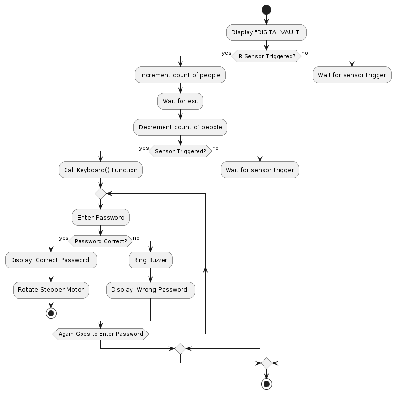
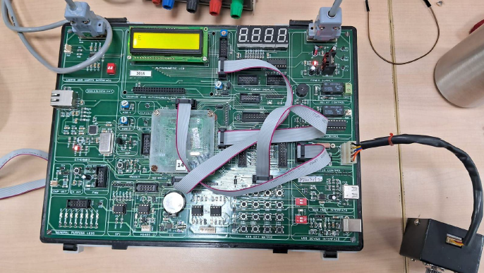

# 🔒 Digital Vault System: LPC1768 Access Control

This project implements a highly secure and reliable **digital vault system** using the **LPC1768 ARM Microcontroller**. It provides fortified access management through password authentication and comprehensive monitoring via strategically tracking entries and exits.

---

## ✨ Key Features

* **Secure Access:** Vault opening is contingent upon correct password entry via a $4 \times 4$ Keyboard Matrix.
* **Dual-Sensor Monitoring:** Uses two IR Sensors (Sensor 1 at entry, Sensor 2 at exit) to accurately track the headcount of individuals accessing the secured area.
* **Mechanical Actuation:** A **Stepper Motor** controls the mechanism for opening the digital vault upon correct password entry.
* **Auditory Alerts:** A **Buzzer** provides immediate auditory feedback upon unauthorized (incorrect password) access attempts.
* **Real-time Feedback:** An **LCD Display** provides dynamic prompts and status messages, enhancing user interaction.
* **Headcount Tracking:** The system tracks entries and exits, providing valuable insights into usage patterns and security.

---

## ⚙️ Hardware & Software

The system is programmed in **Embedded C** and utilizes the LPC1768 evaluation board.

### Development Tools
* **Language:** Embedded C.
* **IDE/Compiler:** **Keil µVision IDE** (used for assembly, debugging, and modeling code).
* **Flashing Tool:** **Flash Magic** (used for In-System Programming/ISP via UART).

### Hardware Connections
The connections are established on the LPC1768 Kit's interface ports.

| Component | Connection Interface (LPC1768) | Purpose |
| :--- | :--- | :--- |
| **Microcontroller** | **LPC1768 ARM Cortex-M3** | Central Processing Unit. |
| **Keypad** | CNB (P1.23-P1.26, P2.10-P2.13) | Password Input. |
| **Stepper Motor**| CNA (P0.4-P0.7) | Vault Opening. |
| **Buzzer**| CNA (P0.11) | Incorrect Password Alert. |
| **IR Sensors**| CNC (P0.15, P0.16) | Headcount Monitoring. |
| **LCD Display**| CND (P0.23-P0.28, P2.0-P2.1) | System Prompts & Feedback. |

---

## 🛠️ Getting Started: Execution and Setup

To compile and test the code, you will need the specific hardware and software environment.

### Execution Flow Diagram
The system's logic, including password verification, motor rotation, and sensor-based counting, is detailed in this flow diagram.



### Circuit Diagram
This diagram details the pin-level hardware connections between the LPC1768 and the external components.


### Physical Circuit Setup
This image shows the circuit assembled on the LPC1768 Evaluation Board.



### Compilation and Flashing

1.  **Clone the Repository:**
    ```bash
    git clone [https://github.com/the-rajanand/Digital-Vault-LPC1768.git](https://github.com/the-rajanand/Digital-Vault-LPC1768.git)
    cd Digital-Vault-LPC1768
    ```
2.  **Open Project:** Open the C source file (`digital_vault.c`) within **Keil µVision IDE**.
3.  **Review Code:** Verify the pin definitions in the source code match your hardware setup.
4.  **Compile:** Compile the C source code within Keil to generate the necessary hex file.
5.  **Flash:** Use **Flash Magic** to upload the compiled hex file to the LPC1768 Microcontroller via the UART/ISP interface.

---

## 👤 Author

* **Raj Anand**
